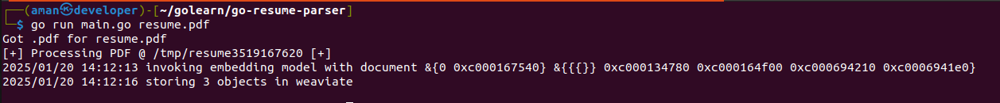
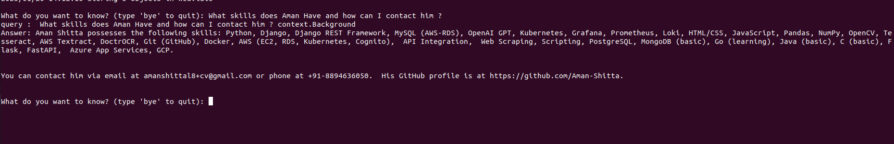
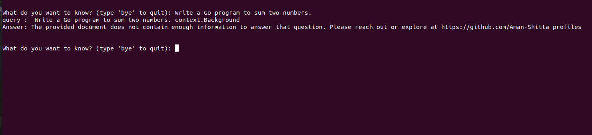
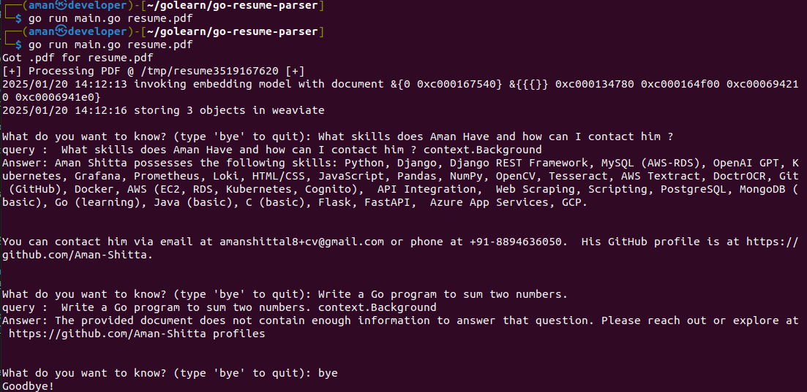

# Resume Parser in Go

## Prerequisites
Ensure your system has the necessary dependencies installed before running the Resume Parser.

### **1. Install Tesseract OCR Library**
```sh
sudo apt install libtesseract-dev
```

### **2. Install JPEG Library**
```sh
sudo apt-get install libjpeg9-dev
```

## **Setting Up Weaviate (Vector Database)**
We use **Weaviate** for AI-powered embedding and querying.

### **1. Install Weaviate Using Docker**
Ensure you have **Docker** installed, then run the following command:
```sh
docker run -p 8080:8080 semitechnologies/weaviate
```
This starts the Weaviate server, making it accessible at `http://localhost:8080`.

## **Configuring AI Embedding and Query Support**
To support AI-powered embeddings and queries, set the `GEMINI_API_KEY` in your environment:
```sh
export GEMINI_API_KEY=<your-api-key>
```
Ensure the API key is correctly configured before running the parser.

## **Running the Resume Parser**
Execute the following command to parse a document (PDF or Image format):
```sh
go run main.go <document.pdf/document.png>
```
Replace `<document.pdf/document.png>` with the actual file path you wish to process.

## **Example Screenshots**
Below are example screenshots showcasing the execution of the Resume Parser and querying the parsed data.

### **1. Running the Program**


### **2. Querying the Data with Proper Questions**


### **3. Querying Out of Context**



### **Full Program**

## **Contributing**
If you'd like to contribute, feel free to submit pull requests or open issues. Happy coding!

## **License**
This project is licensed under the MIT License.
